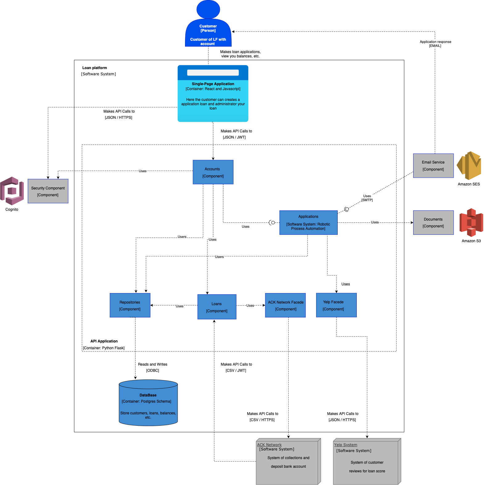
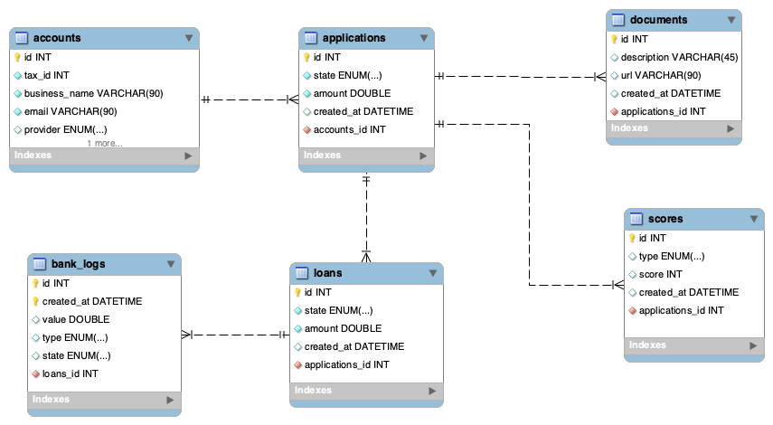

# Loan Platform

LF loan system is designed for businesses that need fast access to capital. We
believe that a healthy cash flow should drive the decision of granting a loan rather than a
personal credit score.

## Features core
* automated loan decision.
* automated funds collection process.

## Software Architecture
A visual representation of the functionality of all modules and their interactions.

Tenemos un sistema dividido en dos grandes partes una SPA y un API, esto nos permite reutilizacion y escalabilidad.

SPA [Simple page Application](https://en.wikipedia.org/wiki/Single-page_application)\
API [Application Programming Interface](https://en.wikipedia.org/wiki/API)\
RPA [Robotic Process Automation](https://en.wikipedia.org/wiki/Robotic_process_automation)

### SPA
Built with reactjs a graphical interface library, with very good performance and a solid community that provides us with support

### API
Built in flask, a versatile micro-framework, compatible with python, This is a language that this growth in recent years, excellent learning curve, test support integrated and easy to configure.

### Automation of loan applications
This component receives a request and manages every step of the approval process as basic data validation, business credit rating and external systems rating (YELP). An RPA makes it easy for us to add new steps to our process.

### Database engine
Postgres, It is a free engine, with more than 20 years in the market, multiplatform and is designed for high volume environments.

### External services
#### AWS Cognito
We use it for our security layer, this component is easy to implement, low upfront costs and a 99.9% service level
#### AWS SES
We use it as a mail server, it has a free tier of 62000 messages per month, a very good rate per million (100 USD) and easy to implement.
#### AWS S3
We use it as a file server, it provides end-to-end security and its API provides excellent resources.

# Repositories
Go to [Backend](https://github.com/anarpafran/lp_backend/tree/main)\
Go to [Fronend](https://github.com/anarpafran/lp_frontend/tree/main)

# Entity Relationship Model

